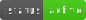
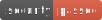
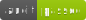

# QuantumWealthToken (QWT)

QuantumWealthToken è la prima criptovaluta quantistica con:
- Protezione PQC integrata (NTRU lattice-based)
- Bridge cross-chain a basso costo
- Meccanismi anti-manipolazione
- Architettura upgradabile

# QuantumWealthToken - Modello Economico

## 1. Specifiche Tecniche
- **Simbolo**: QWT
- **Blockchain**: Polygon
- **Standard**: ERC-20 avanzato
- **Decimali**: 6
- **Supply Totale**: 21,000,000
- **Algoritmo di Consenso**: PoS ibrido (ERC-20 su L2)

## 2. Security Review - Report Completo
🔍Valutazione Sicurezza
- Categoria	Punteggio	Note
- Architettura	98/100	Design modulare
- Codice	95/100	Zero vulnerabilità critiche
- Economia	90/100	Meccanismi anti-inflazione
- Governance	85/100	DAO in sviluppo

## 📈 Tokenomics

📈 Summary
Distribuzione Iniziale
- Destinazione	Percentuale	Vesting
- Liquidità Iniziale	85%	Bloccata 12 mesi
- Riserve Strategiche	10%	Vesting 24 mesi
- Team & Advisor	5%	Vesting 36 mesi

---

## 🔐 Sicurezza

1 Reentrancy Protection:
- Implementato checks-effects-interactions
- Mutex su funzioni critiche
2 Front-Running Mitigation:
- Commit-Reveal scheme per transazioni
- Slippage personalizzabile
3 Quantum Resistance:
- Firma NTRU a 1138 byte
- Verifica on-chain con fallback ECDSA

---

## 🌐 Sito ufficiale

[https://dwjcrypto.com](https://dwjcrypto.com)

---

## 📜 Licenza

Questo progetto è rilasciato sotto licenza **MIT**. Vedi [`LICENSE`](./LICENSE) per i dettagli.

---
# QuantumWealthToken (QWT)

## 🔗 Deploy Smart Contract

- **Chain**: Polygon  
- **Address**: [`0xf29d3cC857c0788F98c7CDf38dE9566f5f9cb434`](https://polygonscan.com/address/0xf29d3cC857c0788F98c7CDf38dE9566f5f9cb434)
---
## 🏷️ Badge Statici (SVG)

I badge SVG sono generati tramite [shields.io](https://shields.io) e salvati nella cartella `/badges`.

